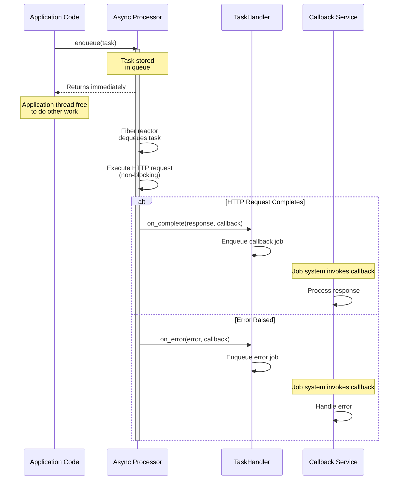
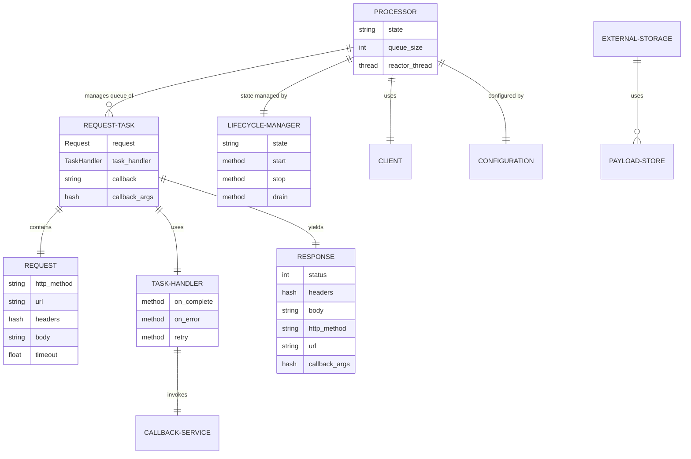

# Architecture

## Overview

AsyncHttpPool provides a mechanism to offload HTTP requests from application threads to a dedicated async I/O processor. The gem uses Ruby's Fiber-based concurrency to handle hundreds of concurrent HTTP requests without blocking application threads.

## Key Design Principles

1. **Non-blocking Threads**: Application threads enqueue HTTP requests and immediately return, freeing them to do other work
2. **Fiber-based Concurrency**: A dedicated processor thread uses the `async` gem to multiplex hundreds of concurrent HTTP connections
3. **Callback Pattern**: HTTP responses are delivered via a pluggable `TaskHandler` that integrates with any job system
4. **Serializable Objects**: Response and error objects are designed to be serialized and passed through job queues

## Core Components

### Processor
The heart of the system - runs in a dedicated thread with its own Fiber reactor. Manages the async HTTP request queue and handles concurrent request execution using the `async` gem.

### TaskHandler
Abstract base class that defines the integration point between the pool and your application. Implementations handle completion callbacks, error callbacks, and job retry operations. This abstraction allows the pool to work with any job system (Sidekiq, Resque, custom queues, etc.).

### Request/RequestTemplate
`Request` is an immutable value object representing an HTTP request. `RequestTemplate` provides a builder for creating requests with shared configuration (base URL, headers, timeout).

### RequestTask
Wraps a `Request` with execution context: the `TaskHandler`, callback class name, and callback arguments. This is what gets enqueued to the processor.

### Response
Immutable value object representing an HTTP response. Includes status, headers, body, and callback arguments. Designed to be serializable for passing through job queues.

### Error Classes
Typed error classes (`HttpError`, `RequestError`, `RedirectError`) that are also serializable. Include context about the failed request and callback arguments.

### Client/ClientPool
Internal HTTP client that handles connection pooling, HTTP/2 support, and request execution within the Fiber reactor.

### LifecycleManager
Manages processor state transitions (stopped → starting → running → draining → stopping) with thread-safe state machines.

### ExternalStorage/PayloadStore
Optional external storage for large request/response payloads. Supports file, Redis, S3, and custom adapters.

## TaskHandler Pattern

The `TaskHandler` abstract class defines how the processor communicates results back to your application:

- **on_complete(response, callback)**: Called when an HTTP request succeeds. Your implementation should enqueue the response for processing (e.g., via a background job).
- **on_error(error, callback)**: Called when an HTTP request fails. Your implementation should enqueue the error for handling.
- **retry**: Called when the processor shuts down with in-flight requests. Your implementation should re-enqueue the original job.

> **Important:** TaskHandler callbacks run on the processor's reactor thread. They should be lightweight and fast -- typically just enqueuing a message for another system to pick up. Doing heavy processing in a callback will block the reactor and delay other in-flight requests.

Example:
```ruby
class MyTaskHandler < AsyncHttpPool::TaskHandler
  def initialize(job_id)
    @job_id = job_id
  end

  def on_complete(response, callback)
    MyJobSystem.enqueue(callback, :on_complete, response.as_json)
  end

  def on_error(error, callback)
    MyJobSystem.enqueue(callback, :on_error, error.as_json)
  end

  def retry
    MyJobSystem.enqueue_job(@job_id)
  end
end

# Enqueue a request
task = AsyncHttpPool::RequestTask.new(
  request: AsyncHttpPool::Request.new(:get, "https://api.example.com/data"),
  task_handler: MyTaskHandler.new("job-123"),
  callback: "ProcessDataCallback",
  callback_args: {user_id: 123}
)
processor.enqueue(task)
```

## Request Lifecycle



## Component Relationships



## Process Model

Each application process can run:
- Multiple application threads
- **One** async HTTP processor thread
- **One** fiber reactor within the processor thread

```
┌─────────────────────────────────────────────────────────────┐
│                    Application Process                      │
│                                                             │
│  ┌──────────────┐   ┌──────────────┐  ┌──────────────┐      │
│  │ Application  │   │ Application  │  │ Application  │      │
│  │ Thread 1     │   │ Thread 2     │  │ Thread N     │      │
│  └──────┬───────┘   └──────┬───────┘  └──────┬───────┘      │
│         │                  │                 │              │
│         └──────────────────┼─────────────────┘              │
│                            │                                │
│                            ▼                                │
│               ┌─────────────────────────┐                   │
│               │  Async HTTP Processor   │                   │
│               │  (Dedicated Thread)     │                   │
│               │                         │                   │
│               │  ┌───────────────────┐  │                   │
│               │  │  Fiber Reactor    │  │                   │
│               │  │  ═════════════    │  │                   │
│               │  │  100+ concurrent  │  │                   │
│               │  │  HTTP requests    │  │                   │
│               │  └───────────────────┘  │                   │
│               └─────────────────────────┘                   │
└─────────────────────────────────────────────────────────────┘
```

## Concurrency Model

The processor uses Ruby's Fiber scheduler (`async` gem) for non-blocking I/O:

1. **Application threads** remain free while HTTP requests execute
2. **Fiber reactor** multiplexes hundreds of HTTP connections
3. **Connection pooling** and HTTP/2 reuse connections efficiently
4. **TaskHandler callbacks** execute on the reactor thread and should be lightweight

## State Management

The processor maintains state through its lifecycle:

- **stopped**: Initial state, not processing requests
- **starting**: Processor is initializing, reactor thread launching
- **running**: Actively processing requests
- **draining**: Not accepting new requests, completing in-flight
- **stopping**: Shutting down, waiting for requests to finish

## Graceful Shutdown

When the processor is stopped with in-flight requests:

1. The processor stops accepting new requests (drain state)
2. In-flight requests are given time to complete (configurable timeout)
3. Any requests still pending when the timeout expires trigger `TaskHandler#retry`
4. The application's job system can re-enqueue these requests for later processing

## Configuration

All behavior is controlled through a central `Configuration` object:

- Maximum concurrent connections
- Request timeouts
- Connection pool settings
- Retry policies
- Proxy configuration
- Logging
- Payload stores for external storage

## External Storage

For large request/response payloads, the `ExternalStorage` class provides optional external storage:

- **PayloadStore adapters**: File, Redis, S3, ActiveRecord, or custom implementations
- **Automatic threshold**: Payloads exceeding a size limit are stored externally
- **Reference-based**: Stored payloads are replaced with lightweight references
- **On-demand fetch**: Original payloads are fetched when needed

## Thread Safety

- **Thread-safe queues**: `Thread::Queue` for request enqueueing
- **Atomic operations**: `Concurrent::AtomicReference` for state
- **Synchronized access**: Mutexes protect shared data structures
- **Immutable values**: Request/Response are immutable once created
